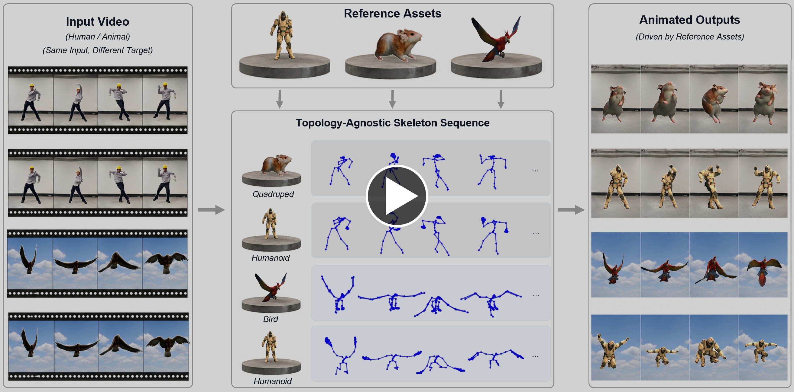
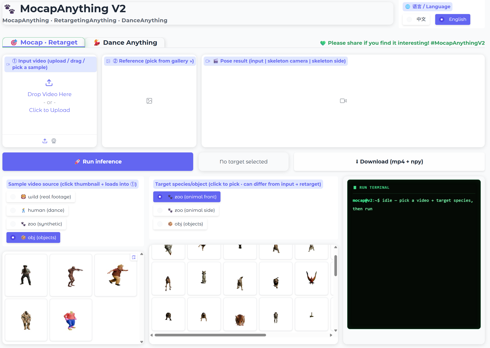

# MoCapAnything V2

**End-to-End Motion Capture for Arbitrary Skeletons from Monocular Videos**

[🤗 **Try the live demo**](https://huggingface.co/spaces/kehong/MoCapAnythingV2) · [Project Page](https://animotionlab.github.io/MoCapAnythingV2/) · [Paper (arXiv)](https://arxiv.org/abs/2604.28130) · [Install & Run](RUN.md)

<p align="center">
  <a href="https://huggingface.co/spaces/kehong/MoCapAnythingV2"></a>
  <a href="https://huggingface.co/kehong/MoCapAnythingV2-weights"></a>
  <a href="https://arxiv.org/abs/2604.28130"></a>
</p>

> ⚠️ **Unofficial code release.** This repository is a reimplementation based on the paper — use as a reference, not a reproduction.

<p align="center">
  <a href="https://animotionlab.github.io/MoCapAnythingV2/" title="Click to watch the 90-second teaser on the project page">
    
  </a>
</p>

<p align="center"><sub>▶ Click the image to watch the 90-second teaser on the project page.</sub></p>

## Updates

- **[2026-05-01]** — 🎉 Code released: end-to-end `video2pose2rot` inference + the release training pipeline.
- **[2026-07-13]** — 🏋️ Pretrained weights on HuggingFace (`kehong/MoCapAnythingV2-weights`).
- **[2026-07-13]** — 🎮 Local interactive demo (`demo/app.py`) + demo data on HuggingFace.
- **[2026-07-13]** — 💃 Dance Anything tab: dance video (with music) → SAM2 picks the dancer → animal performs the dance with the original audio.
- **[2026-07-15]** — 🌐 **[Live online demo on HuggingFace Spaces](https://huggingface.co/spaces/kehong/MoCapAnythingV2)** (ZeroGPU, free) — try it in the browser, no setup: interactive 3D pose + mesh, retargeting, and Dance Anything.
- **[2026-07-15]** — 🖼️ Interactive 3D + shareable **input | skeleton | mesh** clip rendered without Blender (works on Spaces); SAM2 via `transformers`; textured meshes.
- **[TODO]** — 📦 Full training datasets released on HuggingFace.

<p align="center">
  
</p>
<p align="center"><sub>🎮 The interactive demo — <code>python demo/app.py</code>, pick a video + target, hit Run.</sub></p>

## Highlights

- 🔗 **Fully end-to-end.** Video → Pose → Rotation jointly optimized — no analytical IK in the loop.
- ⚓ **Reference-anchored rotation.** A single reference pose–rotation pair from the target asset defines the rotation coordinate system, turning pose-to-rotation into a well-constrained problem.
- ⚡ **Mesh-free and fast.** Joints predicted directly from video, ~20× faster than mesh-based pipelines.
- 🎮 **Interactive web demo** — [try it live on HuggingFace Spaces](https://huggingface.co/spaces/kehong/MoCapAnythingV2) (free, no setup) or run `demo/app.py` locally (same code). Two tabs: **Mocap · Retarget** (video → interactive 3D pose skeleton + textured mesh, plus a synced *input | skeleton | mesh* clip and `.npy` / BVH / glb downloads) and **💃 Dance Anything** (drop a dance video with music → SAM2 picks the dancer → a target creature performs the dance, re-muxed with the original audio). The online build renders in pure Python (no Blender/GL); locally, Blender adds an optional photorealistic render.

## Pipeline

The V2 main model is **`video2pose2rot`** — a single end-to-end network that maps a video directly to BVH-ready joint rotations. Internally it composes two subtasks, `video2pose` and `pose2rot`, that share weights and are jointly fine-tuned; they can be run standalone (e.g. for ablations or debugging), but normal usage is the joint model. The V1 mesh-based pipeline (`video2mesh` + `mesh2pose`) is included as a baseline for comparison.

| Stage | Role | Input | Output |
| --- | --- | --- | --- |
| **`video2pose2rot`** | **V2 — main end-to-end model** | Image sequence + reference | Joint rotations (BVH) |
| &nbsp;&nbsp;↳ `video2pose` | V2 subtask (standalone-runnable) | Image sequence + reference pose | Joint positions |
| &nbsp;&nbsp;↳ `pose2rot` | V2 subtask (standalone-runnable) | Joint positions + rest pose / reference pose-rot pair | Joint rotations |
| `video2mesh` | V1 baseline — mesh sequence (TripoSG) | Image sequence | Mesh (`.glb` / latent) |
| `mesh2pose` | V1 baseline — joints from per-frame meshes | Mesh sequence + reference pose | Joint positions |

A reference frame from a matching species guides the per-species skeleton and scale, enabling generalization to unseen animals.

## Quick Start

Clone the repo, grab the weights + demo data from HuggingFace, and run the bundled examples (or your own videos) end-to-end — no dataset preprocessing required.

```bash
pip install torch torchvision numpy opencv-python pillow matplotlib scipy scikit-image trimesh roma pyyaml tqdm huggingface_hub transformers gradio imageio-ffmpeg

# Weights → ./checkpoints/   ·   Demo data (~160 MB, 1-frame references) → ./demo/data/
hf download kehong/MoCapAnythingV2-weights --local-dir ./checkpoints
hf download kehong/MoCapAnythingV2-data-sample --repo-type dataset --local-dir ./demo/data

# Command-line inference (zoo / obj / in-the-wild)
python inference/video2pose2rot.py --config demo/configs/demo_zoo.yaml

# …or the interactive web demo
python demo/app.py            # http://localhost:7860
```

> The 3D mesh render needs a portable [Blender](https://www.blender.org/download/) build (4.x/5.x): extract it and `export BLENDER_BIN=/path/to/blender` — without it you still get pose `.npy` + BVH + skeleton videos. Checkpoints and datasets live on HuggingFace; only code ships in this repo. The background remover (`briaai/RMBG-1.4`) and DINOv2 auto-download on first run. If torch complains your NVIDIA driver is too old, install a build matching your driver from [pytorch.org](https://pytorch.org/get-started/locally/) (tested: `torch==2.9.0`).

## Use your own rigged character

The preprocessing pipeline is not tied to the released datasets. Point it at your own rigged
FBX and it produces the same artifacts inference consumes — skeleton topology, joint-name
embeddings, reference poses — so you can drive *your* rig with in-the-wild footage.

```bash
export BLENDER=/path/to/blender PYTHON=/path/to/torch/python
bash examples/custom_rig/run.sh MyRig
python -m inference.video2pose2rot --config examples/custom_rig/inference.yaml
```

Walkthrough, required file layout, and troubleshooting: **[examples/custom_rig/README.md](examples/custom_rig/README.md)**.
Stage-by-stage reference: **[preprocess/README.md](preprocess/README.md)**.

## Install & Run

Environment setup, dataset layout, training commands, and inference (including in-the-wild mode) live in **[RUN.md](RUN.md)**.

## Citation

If you use this code, please consider cite:

```bibtex
@article{gong2026mocapanythingv2,
  title   = {MoCapAnything V2: End-to-End Motion Capture for Arbitrary Skeletons},
  author  = {Gong, Kehong and Wen, Zhengyu and Phong, Dao Thien and
             Xu, Mingxi and He, Weixia and Wang, Qi and Zhang, Ning and
             Li, Zhengyu and Hou, Guanli and Lian, Dongze and He, Xiaoyu and
             Zhang, Mingyuan and Zhang, Hanwang},
  journal = {arXiv preprint arXiv:2604.28130},
  year    = {2026}
}
```

If you build on the V1 baselines, please also cite the underlying papers — `mesh2pose` is from **MoCapAnything (V1)**, and `video2mesh` is from **SWiT-4D**:

```bibtex
@InProceedings{Gong_2026_CVPR,
  author    = {Gong, Kehong and Wen, Zhengyu and He, Weixia and Xu, Mingxi and Wang, Qi and Zhang, Ning and Li, Zhengyu and Lian, Dongze and Zhao, Wei and He, Xiaoyu and Zhang, Mingyuan},
  title     = {MoCapAnything: Unified 3D Motion Capture for Arbitrary Skeletons from Monocular Videos},
  booktitle = {Proceedings of the IEEE/CVF Conference on Computer Vision and Pattern Recognition (CVPR)},
  month     = {June},
  year      = {2026},
  pages     = {7089-7099}
}

@article{gong2025swit4d,
  title   = {SWiT-4D: Sliding-Window Transformer for Lossless and Parameter-Free Temporal 4D Generation},
  author  = {Gong, Kehong and Wen, Zhengyu and Xu, Mingxi and He, Weixia and Wang, Qi and
             Zhang, Ning and Li, Zhengyu and Li, Chenbin and Lian, Dongze and
             Zhao, Wei and He, Xiaoyu and Zhang, Mingyuan},
  journal = {arXiv preprint arXiv:2512.10860},
  year    = {2025}
}
```

## License

See the repository for license information.
