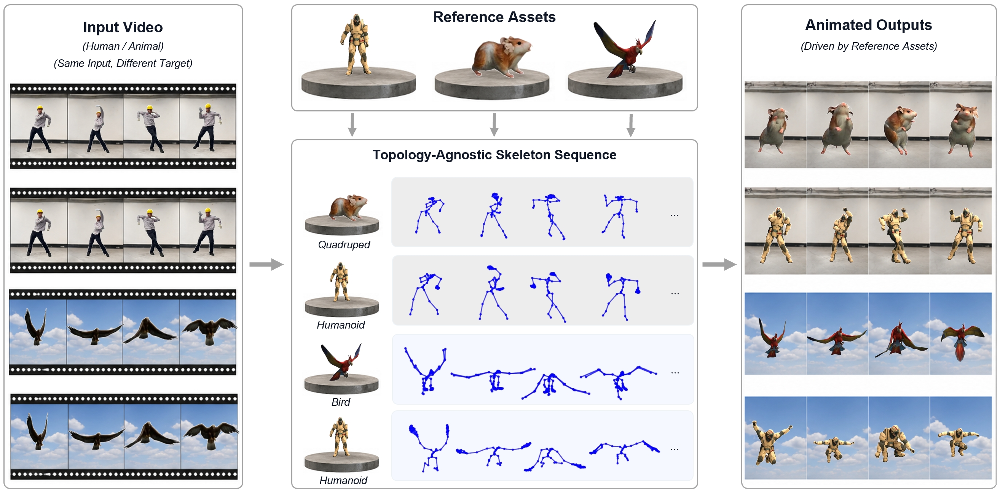

<h1 align="center">MoCapAnything V2</h1>

<h3 align="center">
  End-to-End Motion Capture for Arbitrary Skeletons
</h3>

<p align="center">
  Video &nbsp;→&nbsp; 3D Pose &nbsp;→&nbsp; BVH-ready Rotations
</p>

<p align="center">
  <a href="https://huggingface.co/spaces/kehong/MoCapAnythingV2"></a>
  <a href="https://animotionlab.github.io/MoCapAnythingV2/"></a>
  <a href="https://arxiv.org/abs/2604.28130"></a>
  <a href="https://huggingface.co/kehong/MoCapAnythingV2-weights"></a>
  <a href="https://huggingface.co/datasets/kehong/MoCapAnythingV2-data"></a>
  <a href="https://huggingface.co/datasets/kehong/MoCapAnythingV2-data-sample"></a>
</p>

<p align="center">
  <a href="https://animotionlab.github.io/MoCapAnythingV2/" title="Watch the 90-second teaser">
    
  </a>
</p>

<p align="center">
  <a href="https://animotionlab.github.io/MoCapAnythingV2/">▶ Watch the 90-second teaser</a>
  &nbsp;·&nbsp;
  <a href="RUN.md">Install &amp; Run</a>
  &nbsp;·&nbsp;
  <a href="RUN.md#metrics--reproduction">Reproduce the results</a>
</p>

MoCapAnything V2 directly predicts animation-ready joint rotations from a monocular video and a reference skeleton. It supports animals, humans, objects, and custom rigs without relying on a template-specific body model.

- **End-to-end motion capture.** Video → pose → rotation, jointly optimized without analytical IK.
- **Arbitrary skeletons.** Drive released assets or bring your own rigged FBX character.
- **Mesh-free and fast.** Predict joints directly from video—approximately 20× faster than mesh-based pipelines.

> **About this release:** This is a clean reimplementation of the method, not the original research code that produced the paper's experiments. See [Metrics & Reproduction](RUN.md#metrics--reproduction) for what it reproduces and where it differs from the paper.

## What's new

- **[2026-09-04]** — 📦 [Full training data](https://huggingface.co/datasets/kehong/MoCapAnythingV2-data) (`zoo1030` + `obj1k`, ~25 GB) — **gated**: get [Truebones Zoo](https://truebones.gumroad.com/l/skZMC) from Truebones yourself first (it's pay-what-you-want), then request access. Per-frame DINOv2 features are not shipped; regenerate them with `preprocess/`.
- **[2026-09-04]** — 📊 Released train/test splits now ship in the repository, and [RUN.md](RUN.md#metrics--reproduction) documents the reproduction commands, both training settings, the expected metrics, and how they differ from the paper.
- **[2026-07-15]** — 🌐 [Live Hugging Face demo](https://huggingface.co/spaces/kehong/MoCapAnythingV2) (ZeroGPU, free) with interactive 3D pose, mesh rendering, retargeting, and Dance Anything — no setup required.
- **[2026-07-13]** — 🏋️ [Pretrained V2 weights](https://huggingface.co/kehong/MoCapAnythingV2-weights) and [demo data](https://huggingface.co/datasets/kehong/MoCapAnythingV2-data-sample) released, alongside the local interactive demo (`demo/app.py`).
- **[2026-07-13]** — 💃 Dance Anything: a dance video with music → SAM2 picks the dancer → the target creature performs it, re-muxed with the original audio.
- **[2026-05-01]** — 🎉 End-to-end `video2pose2rot` inference and the release training pipeline released.

<p align="center">
  
</p>
<p align="center"><sub>Run locally with <code>python demo/app.py</code>, or try it directly in your browser.</sub></p>

## Pipeline

The V2 main model is **`video2pose2rot`**—a single end-to-end network that maps a video directly to BVH-ready joint rotations. Internally, it composes two jointly fine-tuned subtasks, `video2pose` and `pose2rot`. Both can also run independently for ablations and debugging. The V1 mesh-based pipeline (`video2mesh` + `mesh2pose`) is included as a baseline.

| Stage | Role | Input | Output |
| --- | --- | --- | --- |
| **`video2pose2rot`** | **V2 main model** | Image sequence + reference | Joint rotations (BVH) |
| &nbsp;&nbsp;↳ `video2pose` | V2 subtask | Image sequence + reference pose | Joint positions |
| &nbsp;&nbsp;↳ `pose2rot` | V2 subtask | Joint positions + reference pose–rotation pair | Joint rotations |
| `video2mesh` | V1 baseline | Image sequence | Mesh (`.glb` / latent) |
| `mesh2pose` | V1 baseline | Mesh sequence + reference pose | Joint positions |

A reference frame from a matching species guides the per-species skeleton and scale, enabling generalization to unseen animals.

## Quick start

Clone the repository, download the weights and demo data, and run the bundled examples—or use your own videos. Dataset preprocessing is not required for inference.

```bash
pip install torch torchvision numpy opencv-python pillow matplotlib scipy scikit-image trimesh roma pyyaml tqdm huggingface_hub transformers gradio imageio-ffmpeg

# Weights → ./checkpoints/ · Demo data → ./demo/data/
hf download kehong/MoCapAnythingV2-weights --local-dir ./checkpoints
hf download kehong/MoCapAnythingV2-data-sample --repo-type dataset --local-dir ./demo/data

# Command-line inference
python inference/video2pose2rot.py --config demo/configs/demo_zoo.yaml

# Or launch the interactive demo at http://localhost:7860
python demo/app.py
```

> The optional textured 3D mesh render requires a portable [Blender](https://www.blender.org/download/) 4.x/5.x build and `BLENDER_BIN=/path/to/blender`. Without Blender, the pipeline still produces pose `.npy`, BVH, and skeleton videos. The background remover (`briaai/RMBG-1.4`) and DINOv2 download on first use. If PyTorch reports that the NVIDIA driver is too old, install a build compatible with your driver from [pytorch.org](https://pytorch.org/get-started/locally/).

For environment setup, dataset layout, training, inference, and troubleshooting, see **[Install & Run](RUN.md)**.

## Training and reproduction

Two settings were trained; we release **Setting A**. Both are documented, and either can be
trained from this repository:

- **Setting A** — the released recipe, with reference-frame augmentation. Better retargeting and in-the-wild results.
- **Setting B** — no reference-frame augmentation. Better benchmark numbers.

Commands, the full hyper-parameters for both, the metrics each produces, and how they compare
to the paper are in **[Metrics & Reproduction](RUN.md#metrics--reproduction)**. The train/test
splits ship in [`datasets/`](datasets/).

## Bring your own rig

The preprocessing pipeline is not tied to the released datasets. Point it at your own rigged FBX to generate the skeleton topology, joint-name embeddings, and reference poses consumed by inference.

```bash
export BLENDER=/path/to/blender PYTHON=/path/to/torch/python
bash examples/custom_rig/run.sh MyRig
python -m inference.video2pose2rot --config examples/custom_rig/inference.yaml
```

See the **[custom-rig walkthrough](examples/custom_rig/README.md)** for the required layout and troubleshooting, or the **[preprocessing reference](preprocess/README.md)** for every stage.

## Citation

If you use this code, please consider citing:

```bibtex
@article{gong2026mocapanythingv2,
  title   = {MoCapAnything V2: End-to-End Motion Capture for Arbitrary Skeletons},
  author  = {Gong, Kehong and Wen, Zhengyu and Phong, Dao Thien and
             Xu, Mingxi and He, Weixia and Wang, Qi and Zhang, Ning and
             Li, Zhengyu and Hou, Guanli and Lian, Dongze and He, Xiaoyu and
             Zhang, Mingyuan and Zhang, Hanwang},
  journal = {arXiv preprint arXiv:2604.28130},
  year    = {2026}
}
```

If you build on the V1 baselines, please also cite the corresponding papers: `mesh2pose` comes from **MoCapAnything (V1)**, and `video2mesh` comes from **SWiT-4D**.

```bibtex
@InProceedings{Gong_2026_CVPR,
  author    = {Gong, Kehong and Wen, Zhengyu and He, Weixia and Xu, Mingxi and Wang, Qi and Zhang, Ning and Li, Zhengyu and Lian, Dongze and Zhao, Wei and He, Xiaoyu and Zhang, Mingyuan},
  title     = {MoCapAnything: Unified 3D Motion Capture for Arbitrary Skeletons from Monocular Videos},
  booktitle = {Proceedings of the IEEE/CVF Conference on Computer Vision and Pattern Recognition (CVPR)},
  month     = {June},
  year      = {2026},
  pages     = {7089-7099}
}

@article{gong2025swit4d,
  title   = {SWiT-4D: Sliding-Window Transformer for Lossless and Parameter-Free Temporal 4D Generation},
  author  = {Gong, Kehong and Wen, Zhengyu and Xu, Mingxi and He, Weixia and Wang, Qi and
             Zhang, Ning and Li, Zhengyu and Li, Chenbin and Lian, Dongze and
             Zhao, Wei and He, Xiaoyu and Zhang, Mingyuan},
  journal = {arXiv preprint arXiv:2512.10860},
  year    = {2025}
}
```

## License

MIT — see [LICENSE](LICENSE). The released V2 weights are MIT as well.

Two things in the pipeline are **not** covered by that grant and follow their own
terms: `preprocess/briarmbg.py` (RMBG-1.4, © BRIA AI) and the Truebones Zoo
motion data. See the third-party notice in [LICENSE](LICENSE).

## Acknowledgements

Animal motion data: [Truebones Zoo](https://truebones.gumroad.com/l/skZMC) by
Truebones Motions Animation Studios. Motion files are not redistributed with
this project.
